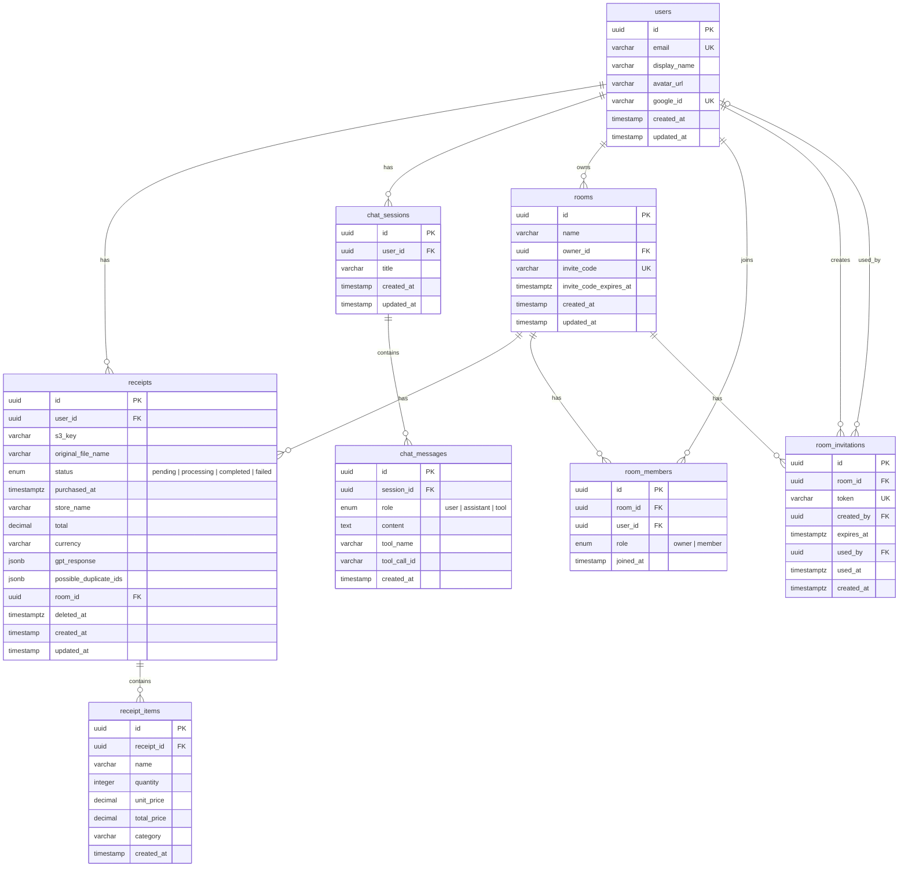

<p align="center">
  
</p>

<p align="center">
  レシートの写真を保存・解析し、LLMとの対話形式で支出状況を確認できるWebアプリケーション
</p>

<p align="center">
  
  
  
  
  
  
  
  
  
</p>

---

## 概要

Credit Checker は、レシート画像をアップロードすると GPT-4o Vision で自動解析し、店名・金額・商品明細・カテゴリを抽出するアプリです。チャット形式で「今月の食費は？」「先月と比べてどう？」といった質問ができ、支出を手軽に把握できます。

### 主な機能

- レシート画像のアップロード・管理（ソフトデリート・復元対応）
- GPT-4o Vision による自動解析（店名・金額・商品明細・カテゴリ分類）
- チャット形式での支出照会
- 月次・カテゴリ別サマリー表示
- ルーム機能（共有スペースでのレシート管理・招待）
- Google OAuth 認証

## 環境変数

`.env.example` をコピーして `.env` を作成する。外部サービスから取得が必要な値は以下の通り。

| 変数 | 取得元 | 必須 |
|------|--------|------|
| `AUTH_GOOGLE_ID` | Google Cloud Console → 認証情報 → OAuth 2.0 クライアント | Yes |
| `AUTH_GOOGLE_SECRET` | 同上 | Yes |
| `OPENAI_API_KEY` | OpenAI Platform → API keys | Yes |

その他の変数はデフォルト値で動作する。詳細は [ADR 003](docs/adr/003-secret-three-categories.md) を参照。

### コマンド一覧

| コマンド | 動作 |
|---------|------|
| `npm run dev` | ローカル環境を起動（setup.sh + docker compose up） |
| `npm run down` | ローカル環境を停止 |
| `npm run logs` | ログをリアルタイム表示 |
| `npm run ps` | サービスの状態確認 |
| `npm run install` | frontend / backend の依存パッケージをインストール |
| `npm run lint` | frontend / backend の lint を実行 |
| `npm run format` | コードフォーマット |

## ディレクトリ構成

```
.
├── apps/
│   ├── frontend/          # Next.js (App Router)
│   └── backend/           # NestJS
│       └── src/
│           ├── entities/  # TypeORM エンティティ
│           ├── migrations/# DBマイグレーション
│           └── modules/   # 機能モジュール
├── infra/                 # AWS CDK (TypeScript)
├── docs/
│   ├── adr/               # アーキテクチャ決定記録
│   ├── architecture/      # システム構成・ER図
│   └── runbooks/          # 運用手順
├── localstack/            # LocalStack 初期化スクリプト
├── .github/workflows/     # CI/CD パイプライン
├── docker-compose.yml
├── setup.sh               # 初回セットアップスクリプト
└── Makefile
```

## ER図



詳細は [ER図ドキュメント](docs/architecture/er-diagram.md) を参照。

## 開発環境の構築

### 前提条件

- Docker / Docker Compose
- Node.js
- Google OAuth クライアント ID / シークレット
- OpenAI API キー

### セットアップ手順

```bash
# 1. リポジトリのクローン
git clone https://github.com/jun-eg/credit-checker.git
cd credit-checker

# 2. 環境変数の設定
cp .env.example .env
# .env を編集し、AUTH_GOOGLE_ID / AUTH_GOOGLE_SECRET / OPENAI_API_KEY を設定

# 3. 起動
npm run dev
```

初回は `setup.sh` が自動実行され、`.env` の値から `secrets/` ファイルを生成してから Docker Compose が起動する。2回目以降は既存の `secrets/` をスキップしてそのまま起動する。

> `secrets/` は `.gitignore` に含まれており、リポジトリにはコミットされない。

### サービス一覧

| サービス | URL |
|---------|-----|
| フロントエンド | http://localhost:3000 |
| バックエンド | http://localhost:3003 |
| LocalStack | http://localhost:4566 |

## トラブルシューティング

### Docker Compose が起動しない

```bash
# コンテナの状態を確認
npm run ps

# ログを確認
npm run logs
```

### データベース接続エラー

PostgreSQL コンテナが healthy になる前に backend が起動しようとする場合がある。`docker compose down` してから再度 `npm run dev` で解決することが多い。

### LocalStack の S3 にアクセスできない

LocalStack コンテナの healthcheck が通るまで時間がかかる場合がある。ログで `Ready.` の出力を確認する。

### マイグレーションが失敗する

```bash
# コンテナ内でマイグレーションを手動実行
docker compose exec backend npm run migration:run
```

### 環境変数が反映されない

`secrets/` フォルダを削除してから再起動すると、`.env` から再生成される。

```bash
rm -rf secrets/
npm run dev
```

## ドキュメント

- [アーキテクチャ概要](docs/architecture/overview.md)
- [ER図](docs/architecture/er-diagram.md)
- [ADR 一覧](docs/adr/)
- [初回セットアップ手順](docs/runbooks/initial-setup.md)
- [デプロイ手順](docs/runbooks/deploy.md)
- [ロールバック手順](docs/runbooks/rollback.md)
- [ECS Exec 手順](docs/runbooks/ecs-exec.md)
