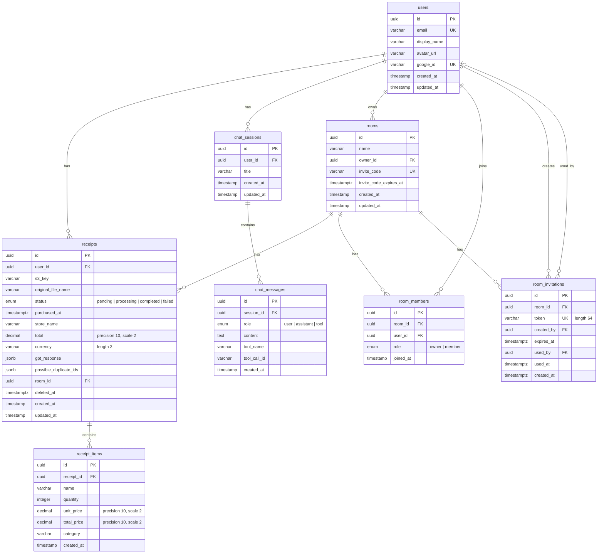

# ER図

```mermaid
erDiagram
    users {
        uuid id PK
        varchar email UK
        varchar display_name
        varchar avatar_url
        varchar google_id UK
        timestamp created_at
        timestamp updated_at
    }

    receipts {
        uuid id PK
        uuid user_id FK
        varchar s3_key
        varchar original_file_name
        enum status "pending | processing | completed | failed"
        timestamptz purchased_at
        varchar store_name
        decimal total "precision 10, scale 2"
        varchar currency "length 3"
        jsonb gpt_response
        jsonb possible_duplicate_ids
        uuid room_id FK
        timestamptz deleted_at
        timestamp created_at
        timestamp updated_at
    }

    receipt_items {
        uuid id PK
        uuid receipt_id FK
        varchar name
        integer quantity
        decimal unit_price "precision 10, scale 2"
        decimal total_price "precision 10, scale 2"
        varchar category
        timestamp created_at
    }

    chat_sessions {
        uuid id PK
        uuid user_id FK
        varchar title
        timestamp created_at
        timestamp updated_at
    }

    chat_messages {
        uuid id PK
        uuid session_id FK
        enum role "user | assistant | tool"
        text content
        varchar tool_name
        varchar tool_call_id
        timestamp created_at
    }

    rooms {
        uuid id PK
        varchar name
        uuid owner_id FK
        varchar invite_code UK
        timestamptz invite_code_expires_at
        timestamp created_at
        timestamp updated_at
    }

    room_members {
        uuid id PK
        uuid room_id FK
        uuid user_id FK
        enum role "owner | member"
        timestamp joined_at
    }

    room_invitations {
        uuid id PK
        uuid room_id FK
        varchar token UK "length 64"
        uuid created_by FK
        timestamptz expires_at
        uuid used_by FK
        timestamptz used_at
        timestamptz created_at
    }

    users ||--o{ receipts : "has"
    users ||--o{ chat_sessions : "has"
    users ||--o{ rooms : "owns"
    users ||--o{ room_members : "joins"
    users ||--o{ room_invitations : "creates"
    receipts ||--o{ receipt_items : "contains"
    rooms ||--o{ receipts : "has"
    rooms ||--o{ room_members : "has"
    rooms ||--o{ room_invitations : "has"
    chat_sessions ||--o{ chat_messages : "contains"
    room_invitations }o--o| users : "used_by"
```
