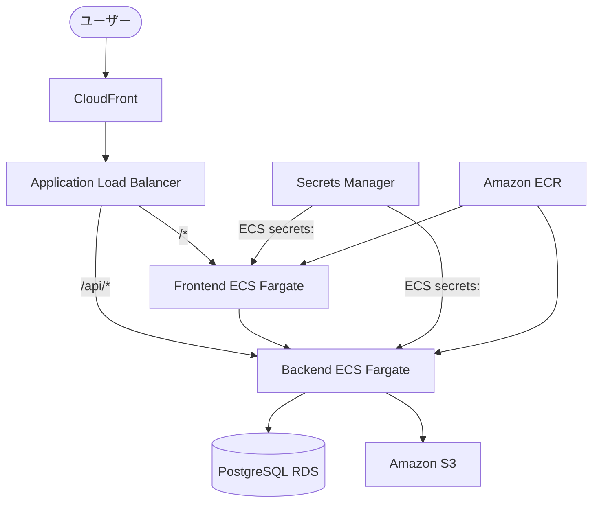
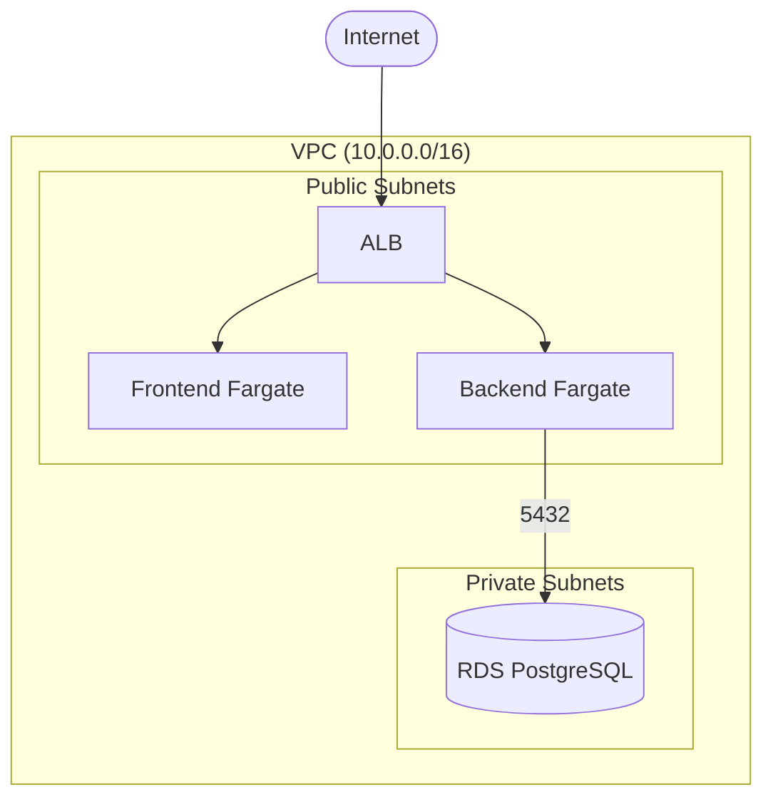

# システムアーキテクチャ概要

## システム全体構成図



## リクエストの流れ

```
ユーザー
  → CloudFront（HTTPS / CDN キャッシュ）
  → ALB（HTTP→HTTPS リダイレクト）
    → /api/* → Backend ECS Service (port 3003)
    → /*     → Frontend ECS Service (port 3000)
  → Backend → RDS PostgreSQL（private subnet）
  → Backend → S3（via Gateway Endpoint）
```

## Secret の流れ

```
AWS Secrets Manager
  └─ /credit-checker/{env}/app-secrets  ※ {env} は小文字（dev / prod）
        ↓ ECS タスク起動時に secrets: フィールドで注入
  コンテナの環境変数（JWT_SECRET, AUTH_SECRET, DATABASE_URL ...）
        ↓
  アプリが process.env.* から読み込む
```

ローカル（docker compose）は `/run/secrets/` ファイルを entrypoint で環境変数に変換してから起動する。
アプリコード自体は環境を意識しない。

## Deploy の流れ

```
GitHub Push (develop → dev / main → prod)
  → GitHub Actions (deploy.yml)
    1. detect-changes: infra / apps どちらに変更があるか検知
    2. deploy-infra: infra/ 変更時のみ CDK deploy
    3. deploy-app: apps/ 変更時
        a. Docker build & push → ECR
        b. migration task 実行（完了待機）
        c. ECS Service 更新（新しいタスク定義 ARN を --task-definition で指定）
        d. services-stable 待機
        e. 失敗時は前リビジョンへ自動 rollback
```

## VPC / サブネット構成



## 環境一覧

| 環境 | AWS アカウント | ドメイン | スケーリング |
|------|--------------|----------|-------------|
| dev | credit-checker-dev | dev.jun-eg.site | min:0 / max:2（夜間停止） |
| prod | credit-checker-prod | jun-eg.site | min:1 / max:3 |
