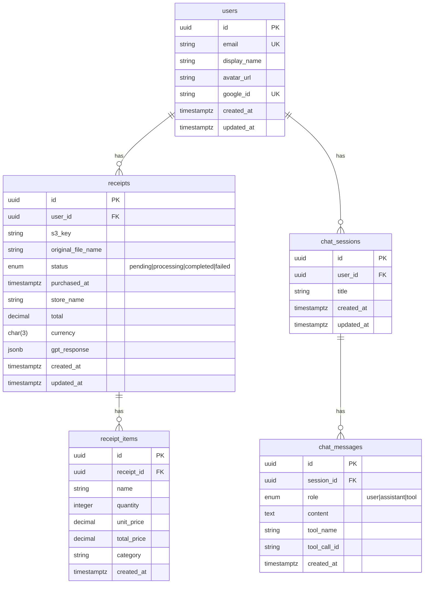

```mermaid
erDiagram
    users {
        uuid id PK
        string email UK
        string display_name
        string avatar_url
        string google_id UK
        timestamptz created_at
        timestamptz updated_at
    }

    receipts {
        uuid id PK
        uuid user_id FK
        string s3_key
        string original_file_name
        enum status "pending|processing|completed|failed"
        timestamptz purchased_at
        string store_name
        decimal total
        char(3) currency
        jsonb gpt_response
        timestamptz created_at
        timestamptz updated_at
    }

    receipt_items {
        uuid id PK
        uuid receipt_id FK
        string name
        integer quantity
        decimal unit_price
        decimal total_price
        string category
        timestamptz created_at
    }

    chat_sessions {
        uuid id PK
        uuid user_id FK
        string title
        timestamptz created_at
        timestamptz updated_at
    }

    chat_messages {
        uuid id PK
        uuid session_id FK
        enum role "user|assistant|tool"
        text content
        string tool_name
        string tool_call_id
        timestamptz created_at
    }

    users ||--o{ receipts : "has"
    receipts ||--o{ receipt_items : "has"
    users ||--o{ chat_sessions : "has"
    chat_sessions ||--o{ chat_messages : "has"
```
